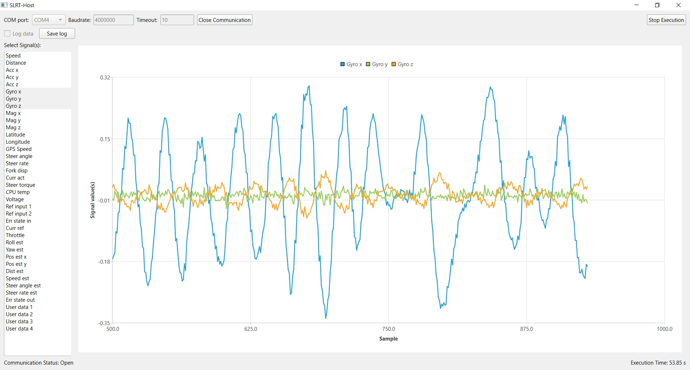

# SBBPYGUI

A PySide6 application for real-time signal communication from the self-balancing bicycle to the computer.

## Requirements

Requirements are:

* Python >= 3.10
* PySide6 >= 6.5.1
* scipy >= 1.1.1

You can install easily the Python requirements (PySide6 and scipy) using `pip` with

```
pip install -r requirements.txt
```

The following modules are already included in Python
* json
* sys
* serial

## Files

The repository contains the following files: 

* `main.py`: main Python script
* `sbbpygui.py`: Python class for the GUI using PySide6
* `sbbtarget.py`: Python class for serial communication with the bicycle microcontroller over USB serial
* `utils.py`: utility Python functions
* `settings.json`: setting file, for controlling the GUI appearance and the default communication settings.

## Getting started

After installing the requirements, you can just run the main script with

```
python main.py
```

Before opening communication, you need to set the COM port used and possibly change the communication settings as desired. Once the communication is open, you can start the execution. You can plot the desired signals using by selecting one or more of the in the signal lists.

